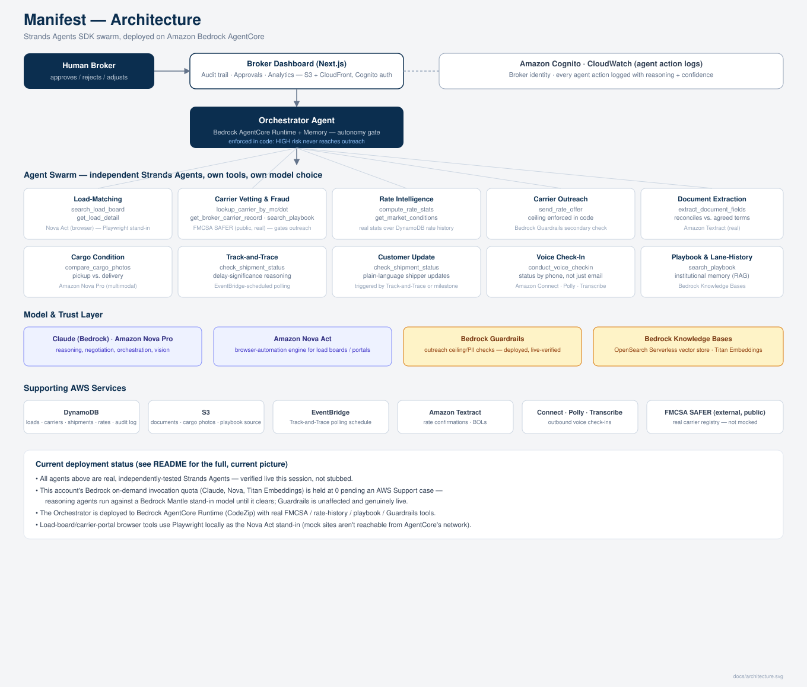
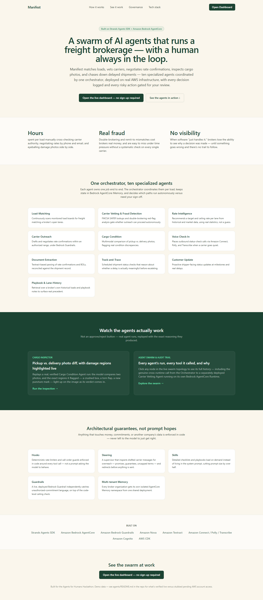
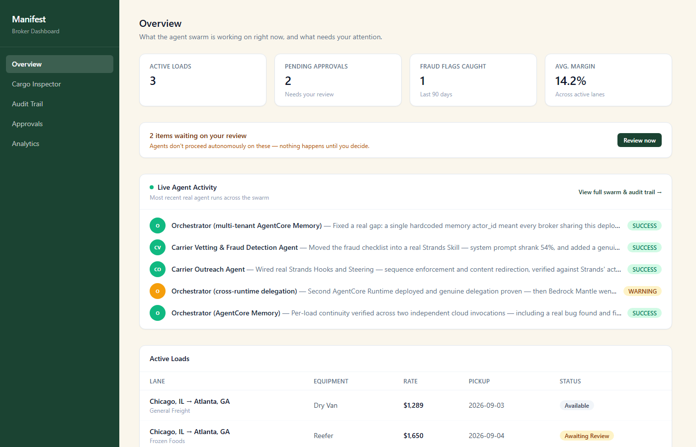
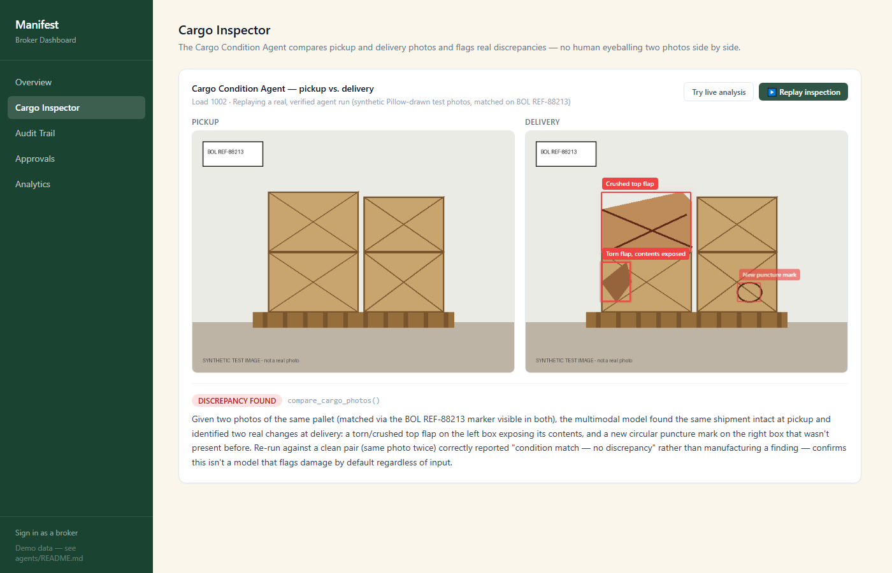
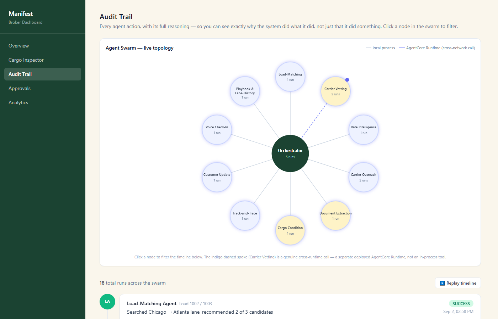
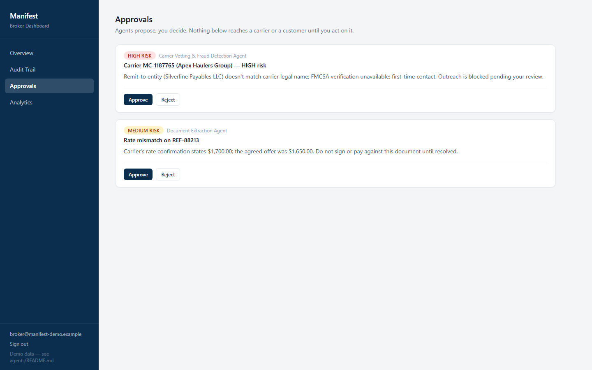
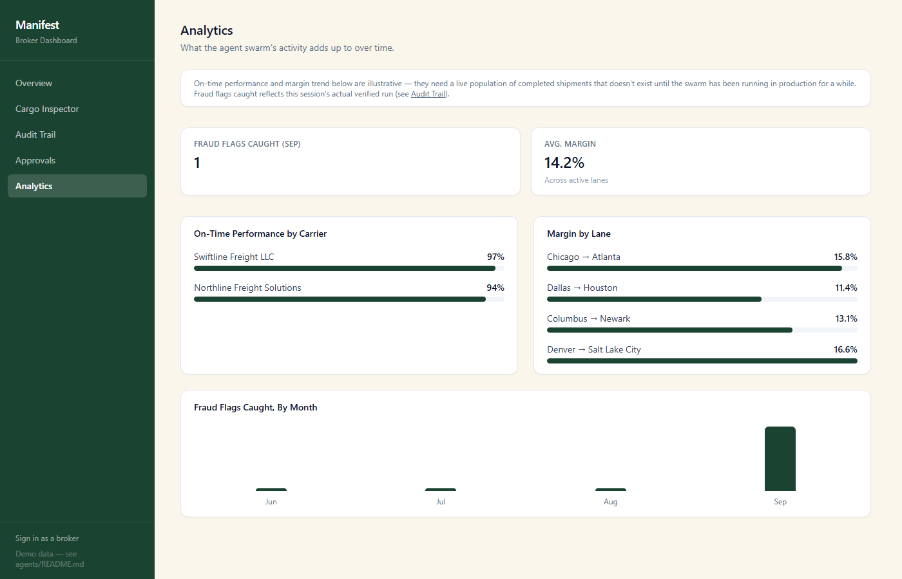

# Manifest

**An autonomous freight brokerage team, built on the Strands Agents SDK and deployed on Amazon Bedrock AgentCore.**

Built for the [Agents for Humans Hackathon](https://agentsforhumans.devpost.com/) — Professional Agents track.

> Status: in active development. This README tracks build progress phase by phase (see [Build phases](#9-build-phases)); sections marked `(planned)` describe work not yet landed.
>
> **Known blocker:** the deployment AWS account's Bedrock model-invocation quotas for Claude and Amazon Nova are currently held at 0 pending an AWS Support case (a below-default account-trust hold, not a config issue on our end). Reasoning agents run today against a temporary stand-in model via Bedrock Mantle; see [agents/README.md](agents/README.md) for the full explanation and the one-env-var swap back to real Claude/Nova once access clears.
>
> **Second, separate blocker found later:** Bedrock Mantle itself (the stand-in) stopped responding for this account partway through this session's testing — surfaced first as multi-turn tool-calling calls failing while single-turn calls kept working, which pointed at an API-path bug; three real fixes were tried (explicit client timeouts, a Mantle multi-turn compat model, switching Responses-API calls to Chat Completions — the last one a confirmed fix for an identical symptom on the vision model elsewhere in this project) before testing showed single-turn calls had *also* started failing identically, ruling out a code-level cause. Most plausibly a rate/quota ceiling from a full session of heavy Mantle usage across ten-plus agents. Classic Bedrock's block (above) is unchanged and unrelated — this is a second, distinct condition layered on top of it. Documented honestly in [agentcore-deploy/README.md](agentcore-deploy/README.md) rather than claimed-fixed; the underlying architecture was genuinely verified working before this appeared.
>
> **Live site:** http://manifest-freight-dashboard.s3-website-us-east-1.amazonaws.com — plain S3 static website hosting, no CDN (an earlier CloudFront distribution was removed to keep a single deployment target). Deep links resolve via the CDK-managed routing rules in [infra/lib/dashboard-hosting-stack.ts](infra/lib/dashboard-hosting-stack.ts). `/` is a public marketing landing page; `/dashboard` is the broker dashboard itself and needs no sign-in or sign-up to view — Amazon Cognito login still exists at `/login` (`broker@manifest-demo.example` / `ManifestDemo2026!`) for a personalized session, but nothing gates on it. `/cargo` replays a real, verified Cargo Condition Agent run with the exact damage regions it flagged highlighted live on the image. Verified end to end with headless-browser runs against the live site. Populated with a real, verified snapshot of this session's agent runs (see the Audit Trail tab); not yet wired to a live backend feed.

---

## 1. What Manifest is

Manifest is a full team of specialized AI agents that runs the entire operational side of a freight brokerage — finding loads, vetting carriers for fraud, negotiating rates, watching shipments in transit by text, voice, and photo, and keeping both the broker and their customer proactively informed — so a human broker spends their day on judgment calls, not data entry.

### The problem

A freight broker's job is to be the matchmaker between a company that needs to ship something and a trucking carrier who can move it. Today that means manually checking load boards, emailing and calling carriers to negotiate, re-typing the same shipment details into disconnected systems, manually checking each carrier's own tracking page, and — increasingly — trying to figure out whether the "carrier" on the other end of an email is even legitimate, because carrier identity fraud and double-brokering scams have become a serious, fast-growing problem in freight. None of the systems a broker touches talk to each other, and none of the trust-and-safety work is automated at all. It's a job that's simultaneously repetitive *and* risky, and today a broker does all of it by hand.

### Who it's for

Independent and small-to-mid-size freight brokers and freight brokerage back-office staff — a large, real, currently underserved professional audience doing skilled, judgment-based work (deciding which carrier to trust, which rate to accept, when a delay is serious enough to escalate) buried under repetitive execution work and manual fraud-checking that don't require a human's time, only a human's occasional judgment.

### Why it matters

Freight brokerage is a massive real industry, this specific bundle of pain (cross-system re-entry, manual negotiation, manual tracking, manual fraud-checking) is extremely well documented, and freight fraud specifically is a current, growing, expensive problem the industry is actively trying to solve. Manifest removes the repetitive and risky execution layer while keeping the human in charge of every real decision.

### Core design principle: human-in-the-loop, always

Manifest never sends a final commitment on the broker's behalf without approval, and never silently swallows a problem. Agents propose; the broker (or a configured autonomy threshold) decides. Every agent action is logged with its reasoning, its confidence, and the data it used, so the broker can audit exactly why the system did what it did — visible in the dashboard's audit trail, not buried in a log file.

---

## 2. The agent roster

Each agent below is a distinct Strands agent with its own tools, its own model choice, and its own job — coordinated by an Orchestrator, not one monolithic prompt.

| Agent | Job | Status |
|---|---|---|
| Load-Matching Agents (swarm) | Continuously scan monitored load boards for freight matching the broker's open lanes and criteria | working — single agent against SummitBoard; swarm-of-sources still planned |
| Carrier Vetting & Fraud Detection Agent | FMCSA SAFER lookups + double-brokering red-flag analysis; gates whether outreach can proceed autonomously | working — cross-referencing logic verified (remit-to mismatch → HIGH risk, human sign-off); also consults the Playbook & Lane-History Agent's retrieval tool for carrier-specific precedent (verified surfacing a real blacklist note). Governed by a real `RateLimiterHookProvider` (caps FMCSA calls) and loads its detailed red-flag checklist from a real Strands **Skill** on demand (54% smaller system prompt as a result). Live FMCSA calls blocked by an FMCSA-side outage, see [agents/README.md](agents/README.md) |
| Rate Intelligence Agent | Recommends a target/ceiling rate per lane from historical + market data, using code execution for the actual statistics | working — verified against seeded rate history + market signal |
| Carrier Outreach Agent | Drafts and negotiates rate confirmations within an authorized range, under Bedrock Guardrails | working — verified end to end; ceiling enforced deterministically in code (the real enforcement). A live, deployed Bedrock Guardrail (not blocked by the account gate — unlike model invocation) correctly catches the exact unauthorized-commitment scenario it was built for; live testing also found topic-policy DENY can't do the numeric "exceeds ceiling" comparison itself, so it flags legitimate offers too — see [agents/README.md](agents/README.md) for why that confirms rather than undermines the code-level check being primary. Also governed by a `RequireCallFirstHookProvider` (can't offer without confirming load details first) and a **steering** supervisor that catches and redirects overreaching draft language (promises, guarantees, uncapped terms) before it can be sent; handles carrier counter-offers via a real Strands **Skill** plus a new deterministic `evaluate_counter_offer` tool |
| Voice Check-In Agent | Places outbound status-check calls via Amazon Connect/Polly/Transcribe when a carrier won't respond by email | working (TTS/STT verified live) — real Amazon Polly + Amazon Transcribe round trip, verified on two scenarios (on-schedule vs. a real breakdown, correctly distinguished and flagged). The one piece not exercised: dialing an actual phone number via Connect's StartOutboundVoiceContact — that rings a real phone, so it needs an explicit target number and consent rather than running autonomously; see [agents/README.md](agents/README.md) |
| Document Extraction Agent | Textract-based parsing of rate confirmations and BOLs, reconciled against the shipment record | working — real Textract calls (not blocked by the Bedrock gate), verified catching a real rate mismatch |
| Cargo Condition Agent | Nova Pro multimodal comparison of pickup vs. delivery cargo photos, flagging condition discrepancies | working (vision stand-in) — verified correctly flagging real damage on a synthetic damaged pair *and* correctly reporting no discrepancy on a clean pair (no false positives); swaps to real Nova Pro once Bedrock access clears |
| Track-and-Trace Agent | Scheduled shipment status checks; reasons about whether a delay is meaningful before escalating | working — verified against the mock carrier portal in both an on-track and a genuinely-delayed scenario; correctly escalates only the latter |
| Customer Update Agent | Proactive shipper-facing status updates at milestones and real delays | working — verified drafting both a delay update (direct, no over-apologizing) and a delivered-milestone update (brief, positive) from real shipment data |
| Playbook & Lane-History Agent | RAG over a Bedrock Knowledge Base of the broker's own historical loads and playbook notes | working (retrieval stand-in) — a real Bedrock Knowledge Base needs a working embedding model, which is blocked by the same account-wide quota gate (verified — Titan Embeddings fails identically to Claude/Nova). Standing in with deterministic keyword retrieval over the same source notes; verified both surfacing real precedent and honestly reporting "no precedent" rather than inventing one. Also wired into Carrier Vetting as a cross-agent integration — verified live pulling a carrier-specific blacklist note into a risk assessment |
| Orchestrator Agent | Coordinates the swarm per active load; maintains state in AgentCore Memory; decides autonomous vs. human-review paths | working, **deployed live to Bedrock AgentCore Runtime as two separate runtimes** (Orchestrator + a standalone Carrier Vetting Agent runtime it delegates to over a real cross-runtime `InvokeAgentRuntime` call — genuine distributed multi-agent orchestration, not one process with many tools), **with real AgentCore Memory, tenant-scoped for genuine multi-tenant data isolation** (a broker-derived `actor_id` maps each tenant to its own AgentCore Memory namespace — see agentcore-deploy/README.md). Locally, chains Load-Matching → Carrier Vetting → [gate] → Rate Intelligence → Carrier Outreach; the gate is enforced in code, not a model's judgment — verified live on two carriers, both correctly escalated. AgentCore Memory persistence verified with two independent cloud calls where the second recalled a prior finding verbatim. One thing genuinely not resolved: live re-verification of the cross-runtime delegation hit Bedrock Mantle becoming unavailable for this account entirely (not just multi-turn calls, once tested further) — three real fixes attempted, none worked, root cause narrowed to a plausible rate/quota ceiling from heavy same-session usage rather than a code defect. Full story, including two other real bugs found and fixed along the way: [agentcore-deploy/README.md](agentcore-deploy/README.md) |
| Broker Dashboard | Public marketing site plus the human-in-the-loop surface: active loads, audit trail, approvals queue, analytics, a Cargo Inspector replay | working — deployed at http://manifest-freight-dashboard.s3-website-us-east-1.amazonaws.com, open to view with no sign-in required (Cognito login still available at `/login` for a personalized session, verified via headless-browser test against the live site); populated from a real captured snapshot of agent runs, not yet live-wired to a backend |

---

## 3. Tech stack

- **Agent framework:** [Strands Agents SDK](https://strandsagents.com) — multi-agent orchestration, tool definitions, structured output, **Hooks** (`BeforeToolCallEvent`/`AfterToolCallEvent` — rate limiting, sequence enforcement), **Steering** (a supervisor that redirects a draft action rather than just blocking it), and **Skills** (`AgentSkills`/`Skill` — procedural knowledge loaded into context only on demand). See [agents/README.md](agents/README.md#governance-strands-hooks-steering-and-skills--architectural-guarantees-not-prompt-hopes) for what's actually wired where.
- **Runtime:** Amazon Bedrock AgentCore (Runtime, Memory — tenant-scoped, see [agentcore-deploy/README.md](agentcore-deploy/README.md#multi-tenancy--one-deployment-isolated-data-per-broker-organization) — Gateway/Identity).
- **Foundation models:** Claude (via Amazon Bedrock) for reasoning/negotiation/orchestration; Amazon Nova Pro for multimodal cargo-photo analysis; Amazon Nova Act for browser-automation tools.
- **Guardrails:** Amazon Bedrock Guardrails on the Carrier Outreach Agent.
- **Retrieval:** Amazon Bedrock Knowledge Bases.
- **Voice:** Amazon Connect + Amazon Polly + Amazon Transcribe.
- **Documents:** Amazon Textract.
- **Data:** DynamoDB (shipment/load/carrier state), S3 (documents, photos).
- **Scheduling:** Amazon EventBridge.
- **Observability:** Amazon CloudWatch.
- **Frontend:** Next.js dashboard, hosted on S3 static website hosting.
- **Auth:** Amazon Cognito.
- **IaC:** AWS CDK (TypeScript).

### Built With (AWS services)

Bedrock AgentCore · Bedrock AgentCore Browser Tool · Bedrock (Claude) · Bedrock Guardrails · Bedrock Knowledge Bases · Amazon Nova Pro · Amazon Nova Act · Amazon Rekognition · Amazon Comprehend · Amazon Connect · Amazon Polly · Amazon Transcribe · Amazon Textract · Lambda · DynamoDB · S3 · EventBridge · CloudWatch · Cognito · CDK

---

## 4. Architecture



The Orchestrator is deployed live to **Amazon Bedrock AgentCore Runtime** — not a diagram claim, verified: `agentcore status` shows `READY`, and `agentcore invoke` runs its real tools (FMCSA lookups, broker carrier records, rate statistics, playbook retrieval, a live Bedrock Guardrails check) in the cloud. See [agentcore-deploy/README.md](agentcore-deploy/README.md) for the deployment specifics and what's deliberately out of scope for this particular deployment (the browser-automation tools, which need the mock sites reachable — verified separately, running locally).

---

## 5. Screenshots

Live captures from the deployed site (http://manifest-freight-dashboard.s3-website-us-east-1.amazonaws.com) — not mockups.

**Landing page** — the public front door, no sign-in required:


**Overview** — active loads, pending approvals, and top-line stats; open to view, no sign-in required:


**Cargo Inspector** — a replay of a real, verified Cargo Condition Agent run, with the exact damage regions it flagged highlighted live on the image:


**Audit Trail** — every agent action with its full reasoning, including the fraud-detection finding on MC-1187765 (Carrier Vetting Agent), the cargo-condition discrepancy (Cargo Condition Agent), and the AgentCore Memory recall proof (Orchestrator):


**Approvals** — the human-in-the-loop queue; nothing below reaches a carrier or customer until the broker acts on it:


**Analytics** — fraud flags caught, margin by lane, on-time performance:


Amazon Cognito login is still real and available at `/login` for brokers who want a personalized session — it just isn't required to view the dashboard.

---

## 6. Repository layout

```
manifest/
├── agents/           Python — Strands Agents SDK multi-agent swarm
│   └── src/manifest_agents/
│       ├── orchestrator/
│       ├── load_matching/
│       ├── carrier_vetting/
│       ├── rate_intelligence/
│       ├── carrier_outreach/
│       ├── voice_checkin/
│       ├── document_extraction/
│       ├── cargo_condition/
│       ├── track_and_trace/
│       ├── customer_update/
│       ├── playbook_rag/
│       └── tools/
├── infra/            AWS CDK (TypeScript) — every AWS resource, stack by stack
├── agentcore-deploy/  Bedrock AgentCore Runtime deployment (Orchestrator, live — see its README)
├── dashboard/         Next.js broker dashboard
├── mock-sites/
│   ├── load-board/    Mock load board (DAT/Truckstop-style) — real login, search, and posting flows
│   └── carrier-portal/ Mock carrier tracking portal — real login and status-update flows
├── seed-data/         Playbook notes and other seed content for local dev/demo
└── docs/              Architecture diagram and supporting docs
```

### Why mock load-board and carrier-portal sites?

Real load boards (DAT, Truckstop.com) and real carrier portals are proprietary, paywalled, and prohibit automated access under their terms of service. The two demo sites in `mock-sites/` are genuinely functional web apps — real login, real search/filter, real state changes — that the Nova Act-powered browser-automation tools operate against in the same way they'd operate against a real site. The one real external integration is the **FMCSA SAFER** carrier-registry API used by the Carrier Vetting Agent, which is free and public.

---

## 7. Local development

### Prerequisites

- Node.js 20+, Python 3.11+
- An AWS account with Bedrock model access enabled for Claude and the Amazon Nova family in your target region (this is a manual step in the Bedrock console — Claude Code cannot do this for you)

### Mock demo sites

```bash
npm install
npm run mock:load-board       # http://localhost:4001  (login: broker1 / manifest2026)
npm run mock:carrier-portal   # http://localhost:4002  (login: swiftline / carrier2026)
```

### Agents

```bash
cd agents
python -m venv .venv && .venv/Scripts/activate   # or source .venv/bin/activate on macOS/Linux
pip install -e ".[dev]"
cp .env.example .env   # fill in table/bucket names once infra is deployed
pytest
```

### Dashboard

```bash
npm run dashboard:dev   # http://localhost:3000
```

### Infrastructure (CDK)

```bash
cd infra
npm install
npm run synth
npm run deploy   # deploys to the AWS account/region configured in your CLI
```

---

## 8. AWS deployment

`(in progress)` — deployed to the AWS account behind `william.nnamani.uk@gmail.com`, `us-east-1`. See `infra/` for the full CDK app; each stack is documented at the top of its file with what it provisions and which build phase completes it.

---

## 9. Build phases

| Phase | Scope | Status |
|---|---|---|
| 0 | Repo scaffolding, tooling, CDK skeleton, mock load-board/carrier-portal sites | done |
| 1 | Load-Matching Agent working end to end against the mock load board | done |
| 2 | Carrier Vetting & Fraud Detection Agent (FMCSA SAFER), Bedrock Guardrails | done |
| 3 | Rate Intelligence, Carrier Outreach, Document Extraction, Voice Check-In | done |
| 4 | Cargo Condition Agent (Nova Pro), Track-and-Trace, Customer Update | done |
| 5 | Playbook & Lane-History Agent (Knowledge Bases), Orchestrator | done |
| 6 | Orchestrator deployed to Bedrock AgentCore | done, including AgentCore Memory for per-load continuity — see [agentcore-deploy/](agentcore-deploy/README.md); full-swarm deployment (every agent as its own runtime) is the next increment |
| 7 | Broker dashboard — audit trail, approvals, analytics | done — live at the link above, with real Cognito login, verified via a real browser test against the live site |
| 8 | Polish, docs, architecture diagram, demo-readiness | in progress |

---

## 10. Demo & submission links

- Demo video: `(add before submission)`
- Live demo: `(add before submission)`
- AWS builder.aws.com build-journey post: `(add before submission)`

---

## License

MIT — see [LICENSE](./LICENSE).
